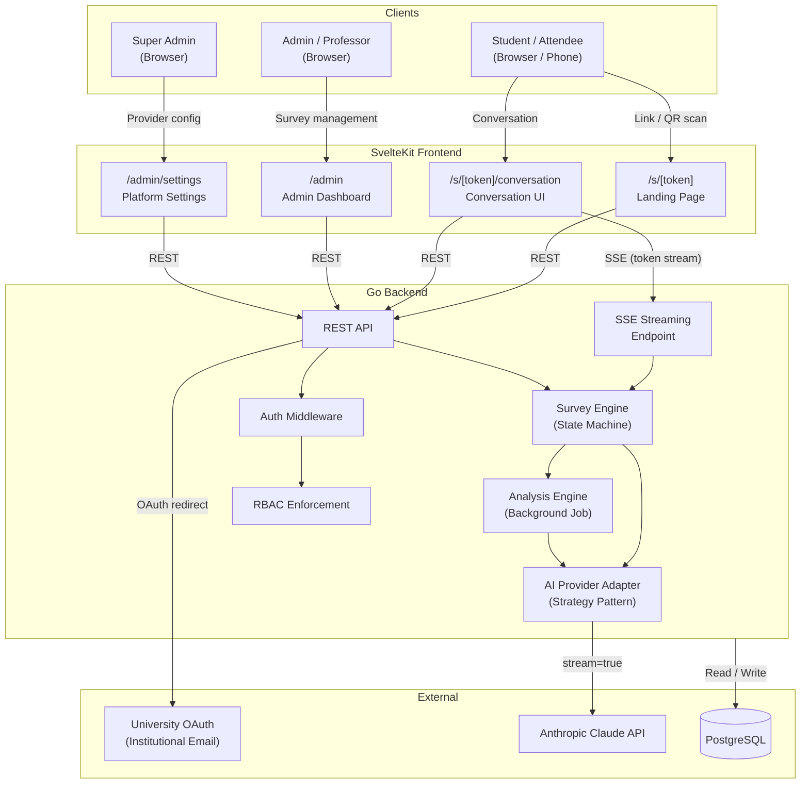
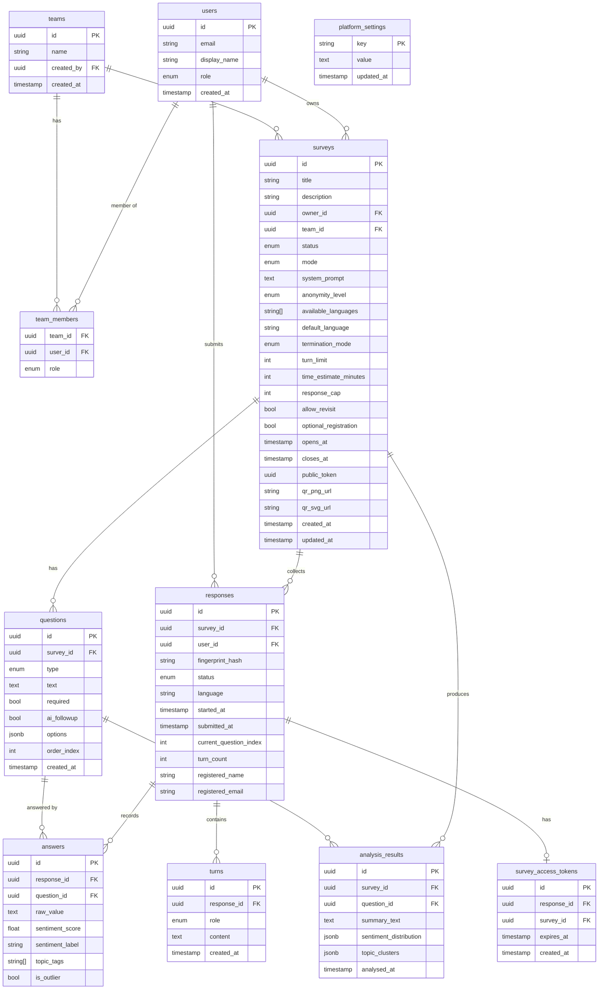
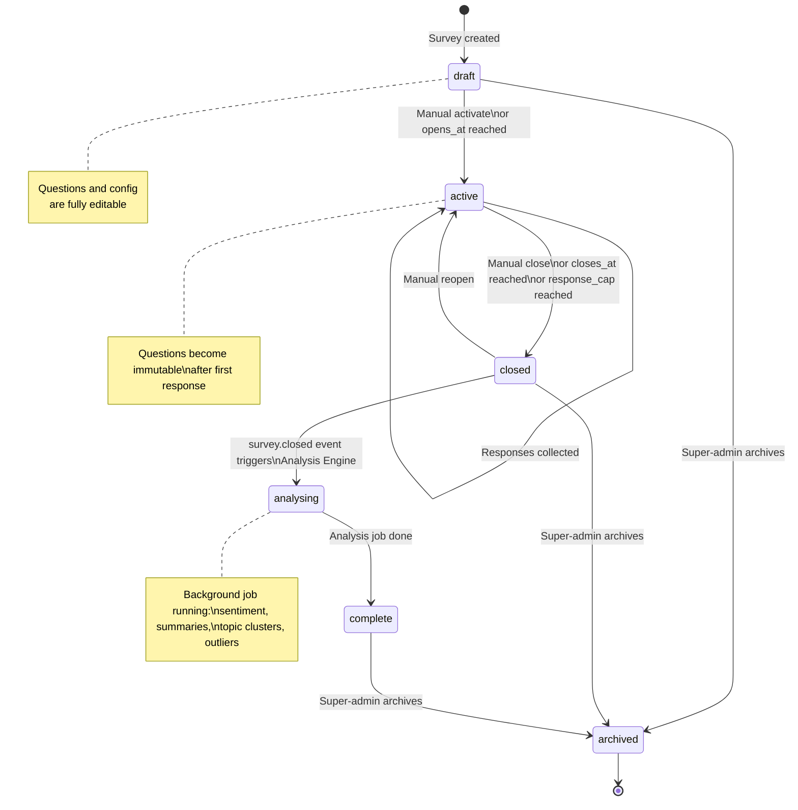
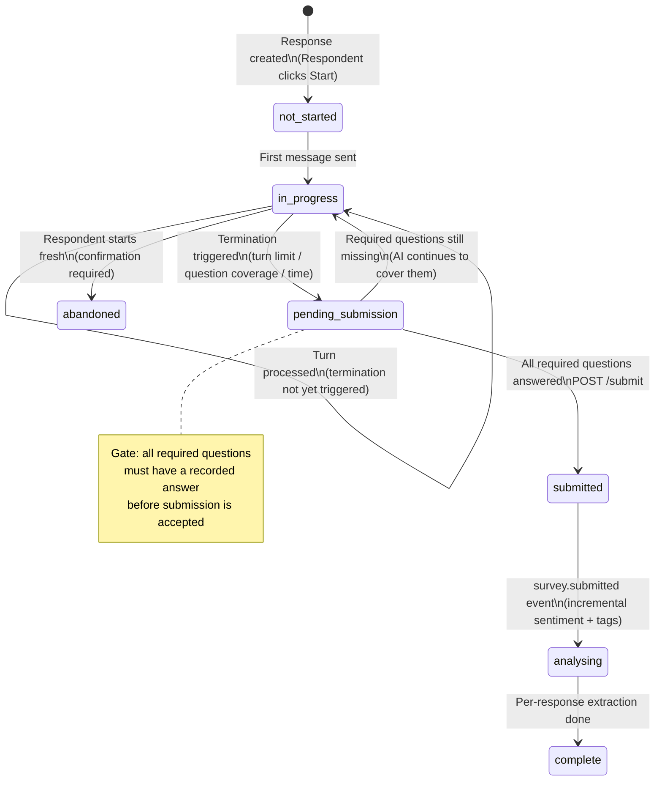
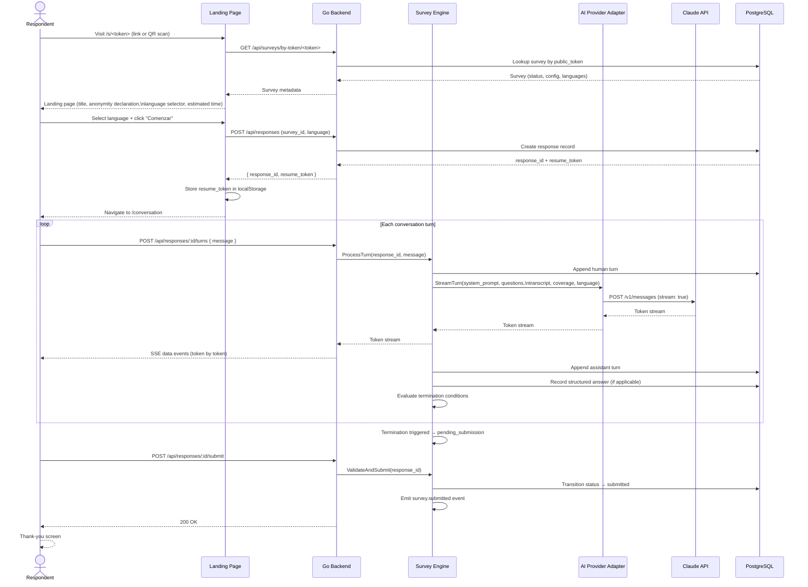
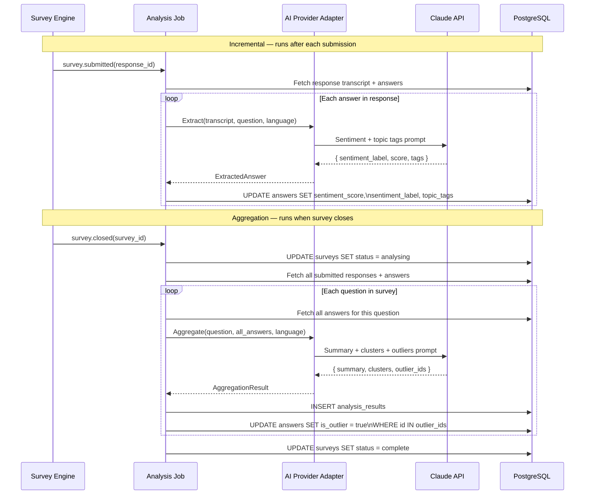
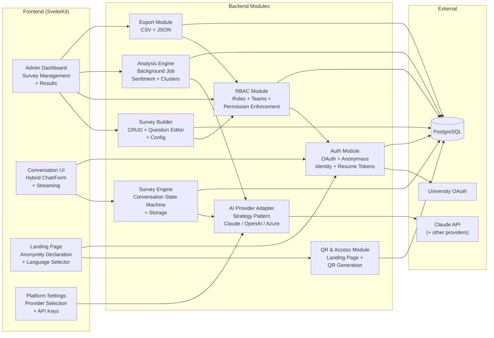
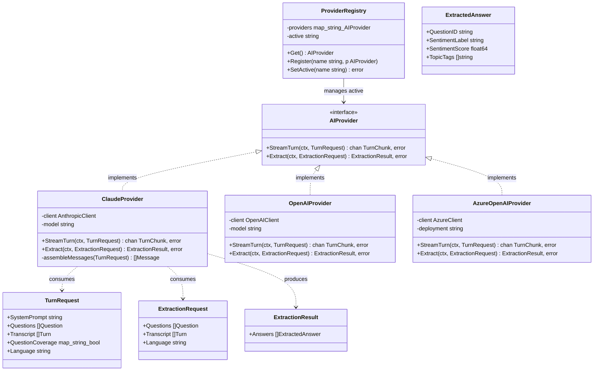
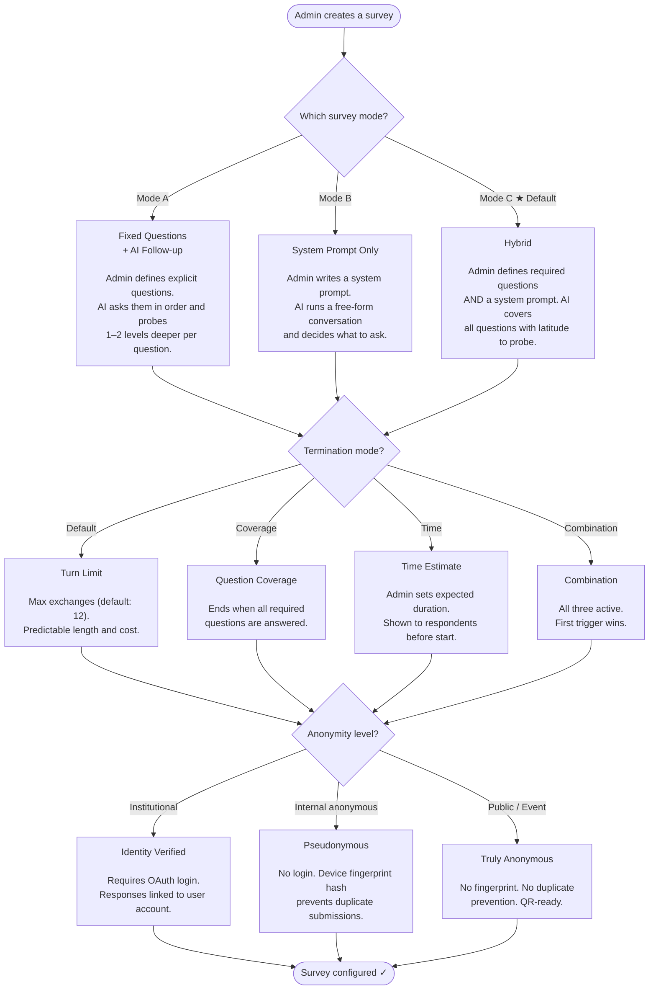
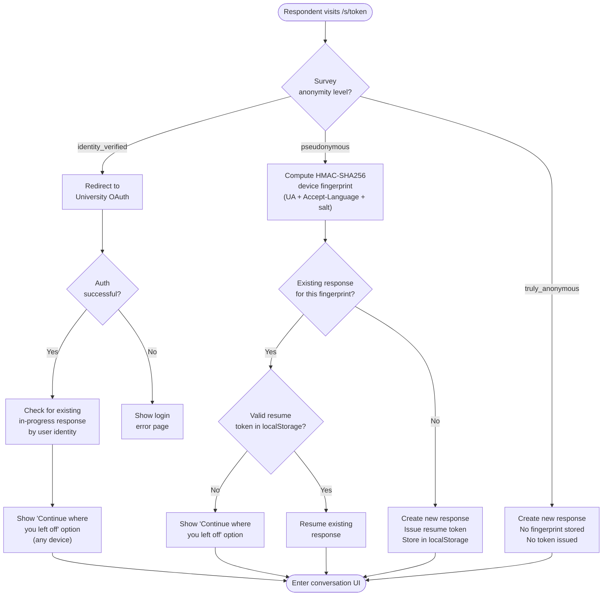

# Architecture & Design Diagrams

## 1. System Architecture

High-level view of all components and their relationships.

---

## 2. Entity Relationship Diagram

---

## 3. Survey Lifecycle State Machine

---

## 4. Response (Conversation) State Machine

---

## 5. Respondent Conversation Flow

---

## 6. Analysis Engine Flow

---

## 7. Module Dependency Map

---

## 8. AI Provider Adapter — Strategy Pattern

---

## 9. Survey Mode Decision Tree (Admin UX)

---

## 10. Authentication & Identity Decision Tree

